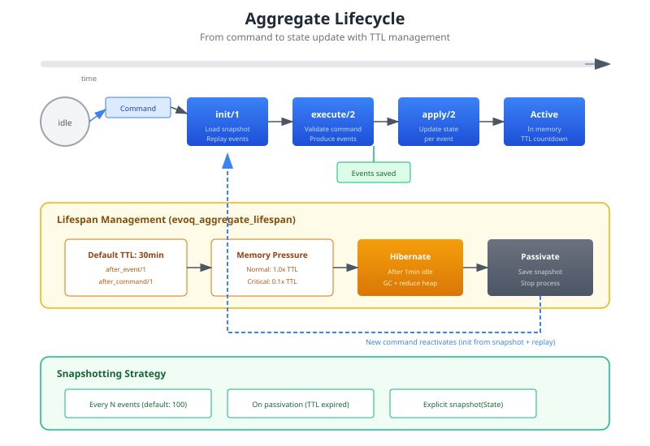

# Aggregates

Aggregates are the core building blocks of your domain. They encapsulate business logic, maintain invariants, and produce events that represent state changes.



## The Aggregate Pattern

An aggregate in evoq:

1. **Receives commands** - User intents to change state
2. **Validates business rules** - Ensures invariants are maintained
3. **Produces events** - Facts representing what happened
4. **Applies events** - Updates internal state

```erlang
-module(bank_account).
-behaviour(evoq_aggregate).

-export([init/1, execute/2, apply/2]).

%% Initialize a new aggregate
init(_AccountId) ->
    {ok, #{balance => 0, status => active}}.

%% Validate command and produce events
execute(#{status := closed}, _Command) ->
    {error, account_closed};
execute(#{balance := Balance}, #{command_type := withdraw, amount := Amount})
  when Amount > Balance ->
    {error, insufficient_funds};
execute(_State, #{command_type := deposit, amount := Amount}) ->
    {ok, [#{event_type => <<"MoneyDeposited">>, data => #{amount => Amount}}]}.

%% Apply event to update state
apply(#{balance := Balance} = State, #{event_type := <<"MoneyDeposited">>, data := #{amount := Amount}}) ->
    State#{balance => Balance + Amount}.
```

## Required Callbacks

### init/1

Called when an aggregate is first created or reactivated.

```erlang
-spec init(AggregateId :: binary()) -> {ok, State :: term()}.

init(AccountId) ->
    %% Return initial state for new aggregate
    {ok, #{
        account_id => AccountId,
        balance => 0,
        opened_at => undefined,
        status => new
    }}.
```

### execute/2

Validates the command against current state and produces events.

```erlang
-spec execute(State :: term(), Command :: map()) ->
    {ok, [Event :: map()]} | {error, Reason :: term()}.

execute(#{status := new}, #{command_type := open_account, initial_deposit := Amount}) ->
    %% The time is decided here, once, and travels in the event.
    OpenedAt = erlang:system_time(millisecond),
    {ok, [
        #{event_type => <<"AccountOpened">>,
          data => #{initial_deposit => Amount, opened_at => OpenedAt}},
        #{event_type => <<"MoneyDeposited">>, data => #{amount => Amount}}
    ]};
execute(#{status := active, balance := Balance}, #{command_type := withdraw, amount := Amount})
  when Amount =< Balance ->
    {ok, [#{event_type => <<"MoneyWithdrawn">>, data => #{amount => Amount}}]};
execute(#{status := active, balance := Balance}, #{command_type := withdraw, amount := Amount})
  when Amount > Balance ->
    {error, {insufficient_funds, Balance, Amount}}.
```

Key patterns:
- Use pattern matching on state for preconditions
- Use guards for numeric validations
- Return `{ok, [Events]}` on success
- Return `{error, Reason}` on validation failure
- **Never** produce events if validation fails
- Anything that is not in the command or the state (the time, a generated id)
  is decided here and put into the event's data. `apply/2` only copies it.

### apply/2

Updates state from a single event. It runs for each event `execute/2`
produces, and again every time the aggregate is loaded later, when its stream
is replayed.

```erlang
-spec apply(State :: term(), Event :: map()) -> NewState :: term().

apply(State, #{event_type := <<"AccountOpened">>, data := Data}) ->
    State#{
        status => active,
        opened_at => maps:get(opened_at, Data),
        initial_deposit => maps:get(initial_deposit, Data)
    };
apply(#{balance := Balance} = State, #{event_type := <<"MoneyDeposited">>, data := #{amount := Amount}}) ->
    State#{balance => Balance + Amount};
apply(#{balance := Balance} = State, #{event_type := <<"MoneyWithdrawn">>, data := #{amount := Amount}}) ->
    State#{balance => Balance - Amount}.
```

Key patterns:
- Must be pure (no side effects)
- Must be deterministic (same input = same output)
- Handle all event types the aggregate produces
- Events always arrive in stream version order, oldest first, both right
  after `execute/2` and on replay.
- The first `apply/2` of a load does not always see the state `init/1`
  returns. When a snapshot exists, it sees the state `from_snapshot/1` rebuilt
  and the event after the snapshot, in the middle of the stream.
- `apply/2` runs once when `execute/2` produces an event and again on every
  later load, so the state must come from `State` and `Event` alone: no clock,
  no I/O, no process state. Reading the clock here, as in
  `opened_at => erlang:system_time(millisecond)`, gives the same account a
  different opening time every time it is loaded.

## Optional Callbacks

### snapshot/1 and from_snapshot/1

Enable snapshotting for faster aggregate loading:

```erlang
-spec snapshot(State :: term()) -> SnapshotData :: term().
snapshot(State) ->
    %% Serialize state for storage
    State.

-spec from_snapshot(SnapshotData :: term()) -> State :: term().
from_snapshot(SnapshotData) ->
    %% Deserialize state from storage
    SnapshotData.
```

When loading an aggregate:
1. Load latest snapshot (if exists)
2. Replay the events after the snapshot's version, in version order, starting
   from the state `from_snapshot/1` returns
3. Much faster than replaying all events

Loading from a snapshot and replaying the whole stream must give the same
state. That holds as long as `apply/2` is pure.

## Lifecycle Management

Aggregates are not kept in memory forever. The `evoq_aggregate_lifespan` behavior controls:

- How long to keep aggregate active
- When to hibernate (reduce memory)
- When to passivate (stop process)
- When to save snapshots

### Default Lifespan

```erlang
%% Default behavior
-module(evoq_aggregate_lifespan_default).

after_event(_Event) ->
    30 * 60 * 1000.  %% 30 minute timeout

after_command(_Command) ->
    30 * 60 * 1000.  %% 30 minute timeout

after_error(_Error) ->
    infinity.  %% Keep active on error for debugging

on_timeout(State) ->
    {snapshot, stop}.  %% Save snapshot, then stop
```

### Custom Lifespan

```erlang
-module(my_aggregate_lifespan).
-behaviour(evoq_aggregate_lifespan).

after_event(#{event_type := <<"HighValueTransaction">>}) ->
    infinity;  %% Keep high-value accounts active
after_event(_) ->
    5 * 60 * 1000.  %% 5 minute timeout for others

after_command(_) ->
    10 * 60 * 1000.

after_error({insufficient_funds, _, _}) ->
    60 * 1000;  %% 1 minute for expected errors
after_error(_) ->
    infinity.  %% Keep active for unexpected errors

on_timeout(State) ->
    case maps:get(balance, State, 0) > 10000 of
        true -> {snapshot, hibernate};  %% Snapshot high-value, hibernate
        false -> {ok, stop}  %% Just stop low-value
    end.
```

## Memory Pressure

The `evoq_memory_monitor` adjusts aggregate TTLs based on system memory:

| Pressure | Memory Usage | TTL Factor | Effect |
|----------|--------------|------------|--------|
| normal | < 70% | 1.0x | Normal TTL |
| elevated | 70-85% | 0.5x | Faster passivation |
| critical | > 85% | 0.1x | Aggressive cleanup |

This prevents OOM conditions under load while keeping aggregates active when memory is available.

## Dispatching Commands

Create and dispatch commands:

```erlang
%% Create a command
Command = evoq_command:new(
    deposit,           %% command type atom
    bank_account,      %% aggregate module
    <<"acc-123">>,     %% aggregate id
    #{amount => 100}   %% payload
),

%% With metadata
CommandWithMeta = evoq_command:with_metadata(Command, #{
    user_id => <<"user-456">>,
    correlation_id => <<"corr-789">>
}),

%% Dispatch
case evoq_dispatcher:dispatch(CommandWithMeta) of
    {ok, NewVersion, ProducedEvents} ->
        %% Success - version and events returned
        ok;
    {error, Reason} ->
        %% Command rejected by aggregate or middleware
        handle_error(Reason)
end.
```

## Concurrency Control

reckon-db uses optimistic concurrency with expected versions:

```erlang
%% First write to new stream
append(StoreId, StreamId, -1, Events)  %% -1 = stream must not exist

%% Append to existing stream
append(StoreId, StreamId, 5, Events)   %% Must be at version 5

%% Append without version check
append(StoreId, StreamId, -2, Events)  %% -2 = any version
```

If another process appended events, you get:

```erlang
{error, {wrong_expected_version, Expected, Actual}}
```

evoq handles this automatically with retries when appropriate.

## Testing Aggregates

Test aggregates in isolation:

```erlang
-module(bank_account_tests).
-include_lib("eunit/include/eunit.hrl").

deposit_test() ->
    {ok, State0} = bank_account:init(<<"test-acc">>),

    %% Execute command
    Command = #{command_type => deposit, amount => 100},
    {ok, Events} = bank_account:execute(State0, Command),

    %% Apply events
    State1 = lists:foldl(fun bank_account:apply/2, State0, Events),

    ?assertEqual(100, maps:get(balance, State1)).

insufficient_funds_test() ->
    {ok, State0} = bank_account:init(<<"test-acc">>),

    Command = #{command_type => withdraw, amount => 100},
    ?assertEqual({error, insufficient_funds}, bank_account:execute(State0, Command)).
```

## Best Practices

### 1. Keep Aggregates Small

Aggregates should be cohesive:
- One aggregate = one consistency boundary
- If two things can change independently, they're separate aggregates
- Large aggregates = more conflicts, slower loading

### 2. Use Domain Language

Events should reflect business meaning:

```erlang
%% Good - business language
#{event_type => <<"AccountOverdrawn">>}
#{event_type => <<"LoyaltyPointsEarned">>}

%% Bad - CRUD language
#{event_type => <<"AccountUpdated">>}
#{event_type => <<"BalanceChanged">>}
```

### 3. Events Are Facts

Events represent what happened, not what will happen:

```erlang
%% Good - past tense, immutable fact
<<"MoneyDeposited">>
<<"AccountClosed">>

%% Bad - future/present tense
<<"DepositMoney">>
<<"CloseAccount">>
```

### 4. Validate Early

Reject invalid commands before producing events:

```erlang
execute(_, #{command_type := deposit, amount := Amount}) when Amount =< 0 ->
    {error, {invalid_amount, Amount}};
execute(State, #{command_type := deposit, amount := Amount}) ->
    %% Only valid deposits reach here
    {ok, [#{event_type => <<"MoneyDeposited">>, data => #{amount => Amount}}]}.
```

## Next Steps

- [Event Handlers](event_handlers.md) - React to events
- [Process Managers](process_managers.md) - Coordinate workflows
- [Projections](projections.md) - Build read models
