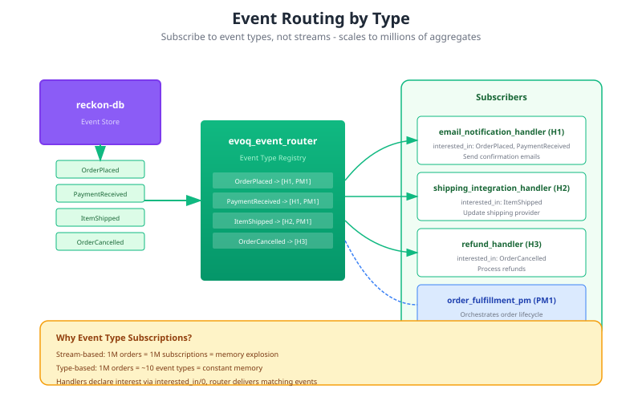

# Event Handlers

Event handlers react to domain events with side effects. They enable loose coupling between the core domain and external concerns like notifications, integrations, and analytics.



## When to Use Event Handlers

Use event handlers for:

- **Notifications** - Send emails, SMS, push notifications
- **External integrations** - Update external systems, APIs
- **Analytics** - Track metrics, log events
- **Side effects** - Anything that doesn't affect domain state

Do **not** use event handlers for:
- Updating aggregate state (use `apply/2`)
- Building read models (use projections)
- Coordinating workflows (use process managers)

## Basic Event Handler

```erlang
-module(email_notification_handler).
-behaviour(evoq_event_handler).

-export([interested_in/0, init/1, handle_event/4]).

%% Declare which event types to receive
interested_in() ->
    [<<"UserRegistered">>, <<"PasswordReset">>, <<"OrderShipped">>].

%% Initialize handler state
init(_Config) ->
    {ok, #{email_service => email_client:connect()}}.

%% Handle each event
handle_event(<<"UserRegistered">>, Event, _Metadata, State) ->
    #{email := Email, name := Name} = maps:get(data, Event),
    send_welcome_email(Email, Name, State),
    {ok, State};

handle_event(<<"PasswordReset">>, Event, _Metadata, State) ->
    #{email := Email, token := Token} = maps:get(data, Event),
    send_password_reset_email(Email, Token, State),
    {ok, State};

handle_event(<<"OrderShipped">>, Event, Metadata, State) ->
    #{order_id := OrderId, tracking := Tracking} = maps:get(data, Event),
    CustomerEmail = lookup_customer_email(OrderId),
    send_shipping_notification(CustomerEmail, Tracking, State),
    {ok, State}.
```

## Required Callbacks

### interested_in/0

Declare which event types this handler wants to receive:

```erlang
-spec interested_in() -> [EventType :: binary()].

interested_in() ->
    [<<"OrderPlaced">>, <<"OrderCancelled">>].
```

The event router only delivers matching events, reducing overhead.

### init/1

Initialize handler state on startup:

```erlang
-spec init(Config :: map()) -> {ok, State :: term()} | {error, Reason :: term()}.

init(Config) ->
    ApiKey = maps:get(api_key, Config),
    Client = external_service:connect(ApiKey),
    {ok, #{client => Client, retry_count => 0}}.
```

### handle_event/4

Process a single event:

```erlang
-spec handle_event(EventType :: binary(), Event :: map(), Metadata :: map(), State :: term()) ->
    {ok, NewState :: term()} | {error, Reason :: term()}.

handle_event(EventType, Event, Metadata, State) ->
    %% EventType: <<"OrderPlaced">>
    %% Event: #{event_type => ..., data => ..., ...}
    %% Metadata: #{aggregate_id => ..., version => ..., timestamp => ...}
    %% State: Handler's internal state

    do_side_effect(Event),
    {ok, State}.
```

## Restarts and Replay

`evoq_store_subscription` rescans the whole event store every time a node
boots, so handlers and projections that keep their state in memory can
rebuild it. Events the node had already consumed before it went down come
around again as **replay**, with `replaying => true` in the metadata. Events
appended while the node was down have never been delivered and arrive
without that key, exactly like live events.

The boundary is the store subscription's persisted checkpoint: how far this
node had consumed the store when it stopped.

A handler with side effects (publishing to the mesh, sending mail,
calling an external API) must not repeat them for replay. Declare it:

```erlang
-export([interested_in/0, init/1, handle_event/4, replay_policy/0]).

replay_policy() -> skip.
```

A handler rebuilding in-memory state from history wants replay:

```erlang
replay_policy() -> deliver.
```

Not declaring it delivers replay, as before `replay_policy/0` existed, and
logs one warning per boot naming the handler the first time it is handed
replay (`what => evoq_handler_received_replay_without_policy`). A handler
with side effects and no policy is the one that warning exists to find.

A handler can also read the flag itself, `maps:get(replaying, Metadata,
false)`, for a decision finer than the whole handler.

Limits:

- The checkpoint is acknowledged every 200 events and on a clean stop.
  After a **crash**, up to 199 events delivered since the last
  acknowledgement arrive as new again. Exactly-once would need a
  checkpoint per handler.
- A node whose persisted checkpoint was never moved (evoq before 1.23.3
  never acknowledged it) sees its whole history as new one more time, on
  its first boot with 1.24.0.

## Retry Strategies

Event handlers can fail (network issues, service unavailable). evoq supports retry strategies:

```erlang
-module(my_handler).
-behaviour(evoq_event_handler).

-export([interested_in/0, init/1, handle_event/4, retry_strategy/0]).

%% Optional callback for retry configuration
retry_strategy() ->
    #{
        max_retries => 5,
        initial_delay => 1000,      %% 1 second
        max_delay => 60000,         %% 1 minute max
        backoff => exponential,     %% exponential | linear | constant
        jitter => true              %% Add randomness to prevent thundering herd
    }.

handle_event(EventType, Event, _Meta, State) ->
    case call_external_api(Event) of
        {ok, _} -> {ok, State};
        {error, temporary} -> {error, temporary};  %% Will retry
        {error, permanent} -> {ok, State}          %% Don't retry, mark as handled
    end.
```

## Dead Letter Queue

Events that fail after all retries go to the dead letter queue:

```erlang
%% Handle dead letters
evoq_dead_letter:list(HandlerName) -> [FailedEvent].
evoq_dead_letter:retry(HandlerName, EventId) -> ok | {error, Reason}.
evoq_dead_letter:discard(HandlerName, EventId) -> ok.

%% Monitor dead letters
evoq_dead_letter:count(HandlerName) -> non_neg_integer().
```

Dead letters include:
- Original event
- Handler name
- Failure reason
- Number of attempts
- Timestamps

## Consistency Modes

Event handlers support two consistency modes:

### Eventual Consistency (Default)

Events processed asynchronously. Best for most use cases.

```erlang
init(Config) ->
    {ok, #{}, #{consistency => eventual}}.
```

Properties:
- Non-blocking command dispatch
- Handler may lag behind writes
- Failures don't affect command success

### Strong Consistency

Events processed before command returns. Use sparingly.

```erlang
init(Config) ->
    {ok, #{}, #{consistency => strong}}.
```

Properties:
- Blocks until handler completes
- Handler failure fails the command
- Higher latency
- Use only when necessary (audit, compliance)

## Start From Position

Control where handler starts processing:

```erlang
init(Config) ->
    {ok, #{}, #{
        start_from => origin    %% Process all historical events
        %% start_from => current   %% Only new events
        %% start_from => {position, 1000}  %% From specific position
    }}.
```

## Idempotency

Handlers may still receive the same event more than once: redelivery, and the crash window described under [Restarts and Replay](#restarts-and-replay). Make handlers idempotent:

```erlang
handle_event(<<"OrderShipped">>, Event, Metadata, State) ->
    EventId = maps:get(event_id, Event),
    case already_processed(EventId, State) of
        true ->
            %% Already handled, skip
            {ok, State};
        false ->
            send_shipping_notification(Event),
            {ok, mark_processed(EventId, State)}
    end.
```

Or use external idempotency keys:

```erlang
handle_event(<<"PaymentProcessed">>, Event, _Meta, State) ->
    IdempotencyKey = maps:get(event_id, Event),
    case payment_gateway:charge(Event, #{idempotency_key => IdempotencyKey}) of
        {ok, _} -> {ok, State};
        {error, already_processed} -> {ok, State};  %% Gateway handled idempotency
        {error, Reason} -> {error, Reason}
    end.
```

## Multiple Handlers Per Event

Different handlers can process the same event type:

```erlang
%% Handler 1: Send email
-module(email_handler).
interested_in() -> [<<"OrderPlaced">>].

%% Handler 2: Update analytics
-module(analytics_handler).
interested_in() -> [<<"OrderPlaced">>].

%% Handler 3: Notify warehouse
-module(warehouse_handler).
interested_in() -> [<<"OrderPlaced">>].
```

All three receive `OrderPlaced` events independently.

## Handler Registration

Register handlers in your application supervisor:

```erlang
-module(my_app_sup).

init([]) ->
    Children = [
        %% Register event handlers
        {email_handler, {evoq_event_handler, start_link, [email_handler, #{}]},
            permanent, 5000, worker, [evoq_event_handler]},

        {analytics_handler, {evoq_event_handler, start_link, [analytics_handler, #{
            api_key => <<"...">>
        }]}, permanent, 5000, worker, [evoq_event_handler]}
    ],
    {ok, {{one_for_one, 5, 10}, Children}}.
```

## Testing Event Handlers

Test handlers in isolation:

```erlang
-module(email_handler_tests).
-include_lib("eunit/include/eunit.hrl").

handle_user_registered_test() ->
    %% Setup
    {ok, State} = email_handler:init(#{email_service => mock_email}),

    Event = #{
        event_type => <<"UserRegistered">>,
        data => #{email => <<"test@example.com">>, name => <<"Test User">>}
    },
    Metadata = #{aggregate_id => <<"user-123">>, version => 1},

    %% Execute
    {ok, _NewState} = email_handler:handle_event(<<"UserRegistered">>, Event, Metadata, State),

    %% Verify email was sent (via mock)
    ?assert(mock_email:was_called_with(<<"test@example.com">>)).
```

## Telemetry Events

Event handlers emit telemetry:

| Event | Measurements | Metadata |
|-------|--------------|----------|
| `[evoq, handler, start]` | system_time | handler, event_type |
| `[evoq, handler, stop]` | duration | handler, event_type |
| `[evoq, handler, exception]` | duration | handler, error, stacktrace |
| `[evoq, handler, retry]` | attempt | handler, event_type, reason |
| `[evoq, handler, dead_letter]` | system_time | handler, event_type, reason |

## Best Practices

### 1. Keep Handlers Focused

One handler = one responsibility:

```erlang
%% Good - focused
-module(order_email_handler).      %% Just emails
-module(order_analytics_handler).   %% Just analytics

%% Bad - doing too much
-module(order_handler).  %% Emails + analytics + logging + ...
```

### 2. Handle Failures Gracefully

```erlang
handle_event(EventType, Event, _Meta, State) ->
    try
        do_risky_operation(Event),
        {ok, State}
    catch
        error:temporary_failure ->
            {error, temporary};  %% Retry
        error:permanent_failure ->
            log_and_alert(Event),
            {ok, State}  %% Don't retry, but continue
    end.
```

### 3. Log Extensively

```erlang
handle_event(EventType, Event, Metadata, State) ->
    logger:info("Processing ~p for aggregate ~p",
        [EventType, maps:get(aggregate_id, Metadata)]),

    Result = do_work(Event),

    logger:info("Completed ~p: ~p", [EventType, Result]),
    {ok, State}.
```

### 4. Monitor Dead Letters

Set up alerts for dead letter growth:

```erlang
%% In your monitoring system
check_dead_letters() ->
    Handlers = [email_handler, analytics_handler],
    lists:foreach(fun(Handler) ->
        Count = evoq_dead_letter:count(Handler),
        telemetry:execute([my_app, dead_letters], #{count => Count}, #{handler => Handler})
    end, Handlers).
```

## Next Steps

- [Process Managers](process_managers.md) - Coordinate multi-step workflows
- [Projections](projections.md) - Build read models
- [Architecture](architecture.md) - System overview
