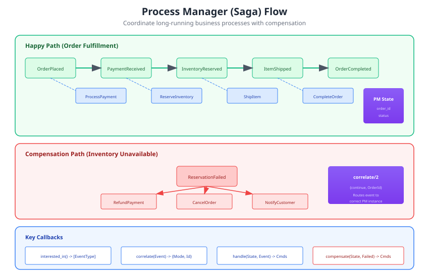

# Process Managers

Process managers (also called sagas) coordinate long-running business processes that span multiple aggregates. They react to events and dispatch commands to drive workflows forward.



## When to Use Process Managers

Use process managers when:

- A business process spans **multiple aggregates**
- You need to **coordinate** a sequence of operations
- Failures require **compensation** (rollback)
- The process has **state** that persists across events

Examples:
- Order fulfillment (payment → inventory → shipping)
- User onboarding (account → profile → welcome email)
- Money transfer (debit source → credit destination)

## Basic Process Manager

```erlang
-module(order_fulfillment_pm).
-behaviour(evoq_process_manager).

-export([interested_in/0, correlate/2, handle/3, apply/2]).

%% Events this process manager reacts to
interested_in() ->
    [<<"OrderPlaced">>, <<"PaymentReceived">>, <<"InventoryReserved">>, <<"ItemShipped">>].

%% Route events to the correct process instance
correlate(#{data := #{order_id := OrderId}}, _Metadata) ->
    {continue, OrderId}.

%% React to events by dispatching commands
handle(State, #{event_type := <<"OrderPlaced">>} = Event, _Meta) ->
    OrderId = maps:get(order_id, maps:get(data, Event)),
    Amount = maps:get(amount, maps:get(data, Event)),

    %% Dispatch command to payment aggregate
    Cmd = evoq_command:new(process_payment, payment, OrderId, #{amount => Amount}),
    {ok, State#{status => awaiting_payment}, [Cmd]};

handle(State, #{event_type := <<"PaymentReceived">>}, _Meta) ->
    OrderId = maps:get(order_id, State),

    %% Dispatch command to inventory aggregate
    Cmd = evoq_command:new(reserve_inventory, inventory, OrderId, #{}),
    {ok, State#{status => awaiting_inventory}, [Cmd]};

handle(State, #{event_type := <<"InventoryReserved">>}, _Meta) ->
    OrderId = maps:get(order_id, State),

    %% Dispatch command to shipping aggregate
    Cmd = evoq_command:new(ship_item, shipping, OrderId, #{}),
    {ok, State#{status => awaiting_shipment}, [Cmd]};

handle(State, #{event_type := <<"ItemShipped">>}, _Meta) ->
    %% Process complete
    {ok, State#{status => completed}}.

%% Update process state from events
apply(State, #{event_type := <<"OrderPlaced">>, data := Data}) ->
    State#{
        order_id => maps:get(order_id, Data),
        customer_id => maps:get(customer_id, Data),
        items => maps:get(items, Data),
        status => started
    };
apply(State, _Event) ->
    State.
```

## Required Callbacks

### interested_in/0

Declare which event types this process manager reacts to:

```erlang
-spec interested_in() -> [EventType :: binary()].

interested_in() ->
    [<<"OrderPlaced">>, <<"PaymentFailed">>, <<"InventoryUnavailable">>].
```

### correlate/2

Route events to the correct process instance:

```erlang
-spec correlate(Event :: map(), Metadata :: map()) ->
    {start, ProcessId :: binary()} |
    {continue, ProcessId :: binary()} |
    {stop, ProcessId :: binary()} |
    false.

%% Start a new process
correlate(#{event_type := <<"OrderPlaced">>, data := #{order_id := OrderId}}, _Meta) ->
    {start, OrderId};

%% Continue existing process
correlate(#{event_type := <<"PaymentReceived">>, data := #{order_id := OrderId}}, _Meta) ->
    {continue, OrderId};

%% Stop the process
correlate(#{event_type := <<"OrderCancelled">>, data := #{order_id := OrderId}}, _Meta) ->
    {stop, OrderId};

%% Ignore event (no matching process)
correlate(_, _) ->
    false.
```

A process instance belongs to its process manager: the ProcessId names an
instance of THIS process manager only. Two process managers that correlate
on the same id (both on an order id, say) each get their own instance and
their own state. Before 1.26.0 instances were found by event type and id
alone, so they could reach each other's instance.

Every event of a PM's types is delivered to it as long as some event
handler also consumes that type: the store subscription routes a type only
when a handler holds it (evoq #2). A type only a process manager declares is
not delivered yet; until that is fixed, give such a type a handler.

### handle/3

React to events and optionally dispatch commands:

```erlang
-spec handle(State :: term(), Event :: map(), Metadata :: map()) ->
    {ok, NewState :: term()} |
    {ok, NewState :: term(), Commands :: [map()]}.

%% Just update state
handle(State, #{event_type := <<"OrderPlaced">>}, _Meta) ->
    {ok, State#{started_at => erlang:system_time()}};

%% Update state and dispatch commands
handle(State, #{event_type := <<"PaymentReceived">>}, _Meta) ->
    Cmd1 = evoq_command:new(reserve_inventory, inventory, OrderId, #{}),
    Cmd2 = evoq_command:new(notify_warehouse, warehouse, OrderId, #{}),
    {ok, State#{payment_received => true}, [Cmd1, Cmd2]}.
```

### apply/2

Update process state from events. The runtime calls `handle/3` first, then
`apply/2` on the state `handle/3` returned, so `handle/3` sees the state as it
was before this event:

```erlang
-spec apply(State :: term(), Event :: map()) -> NewState :: term().

apply(State, #{event_type := <<"OrderPlaced">>, data := Data}) ->
    State#{
        order_id => maps:get(order_id, Data),
        total => maps:get(total, Data)
    };
apply(State, #{event_type := <<"PaymentReceived">>, data := #{amount := Amount}}) ->
    State#{paid_amount => Amount}.
```

## Compensation (Rollback)

When a step fails, the process manager can compensate by undoing previous steps:

```erlang
-module(money_transfer_pm).
-behaviour(evoq_process_manager).

-export([interested_in/0, correlate/2, handle/3, apply/2, compensate/2]).

interested_in() ->
    [<<"TransferInitiated">>, <<"SourceDebited">>, <<"DestinationCreditFailed">>].

handle(State, #{event_type := <<"TransferInitiated">>}, _Meta) ->
    %% Step 1: Debit source account
    Cmd = evoq_command:new(debit, account, SourceId, #{amount => Amount}),
    {ok, State#{status => debiting_source}, [Cmd]};

handle(State, #{event_type := <<"SourceDebited">>}, _Meta) ->
    %% Step 2: Credit destination account
    Cmd = evoq_command:new(credit, account, DestId, #{amount => Amount}),
    {ok, State#{status => crediting_dest}, [Cmd]};

handle(State, #{event_type := <<"DestinationCreditFailed">>}, _Meta) ->
    %% Credit failed - need to compensate
    {ok, State#{status => compensating}}.

%% Compensation callback
-spec compensate(State :: term(), FailedCommand :: map()) ->
    {ok, CompensatingCommands :: [map()]} | skip.

compensate(#{source_id := SourceId, amount := Amount}, #{command_type := credit}) ->
    %% Credit failed, refund the source account
    RefundCmd = evoq_command:new(credit, account, SourceId, #{
        amount => Amount,
        reason => <<"transfer_failed">>
    }),
    {ok, [RefundCmd]};

compensate(_, _) ->
    skip.
```

## Restarts and Replay

Process manager instances live in memory, so after a restart they are
rebuilt by replaying history: every event the node had already consumed
before it went down comes around again with `replaying => true` in the
metadata.

For replay, `handle/3` and `apply/2` both run, so an instance rebuilds
exactly the state it had, including state kept in `handle/3` as in the
state machine pattern below. **The commands `handle/3` returns are not
dispatched**: the process manager already reacted to that event, and
dispatching again would re-issue its whole history on every restart.

Events appended while the node was down were never delivered, arrive
without `replaying`, and are handled and dispatched normally.

If `handle/3` has a side effect of its own rather than returning a
command, check `maps:get(replaying, Metadata, false)` before performing
it. After a crash, up to 199 events delivered since the last acknowledged
checkpoint arrive as new again, so commands should still be idempotent.

## State Machine Pattern

Process managers naturally model state machines:

```erlang
-module(order_state_machine_pm).

%% State transitions
handle(#{status := new} = State, #{event_type := <<"OrderPlaced">>}, _) ->
    {ok, State#{status => awaiting_payment}, [process_payment_cmd()]};

handle(#{status := awaiting_payment} = State, #{event_type := <<"PaymentReceived">>}, _) ->
    {ok, State#{status => awaiting_shipment}, [ship_order_cmd()]};

handle(#{status := awaiting_payment} = State, #{event_type := <<"PaymentFailed">>}, _) ->
    {ok, State#{status => cancelled}, [notify_customer_cmd()]};

handle(#{status := awaiting_shipment} = State, #{event_type := <<"ItemShipped">>}, _) ->
    {ok, State#{status => completed}};

%% Invalid transition - ignore
handle(State, _Event, _Meta) ->
    {ok, State}.
```

## Instance Lifetime

An instance lives in memory until a `{stop, Id}` event ends it. There is no
timeout callback: the instance's idle timer only logs. A process that never
reaches a `{stop, Id}` keeps one process per id for the life of the node, so
give every process a terminal event, and design ones that can stall so that
something (a scheduled command, another aggregate's event) produces it.

- `{start, Id}` always starts a new instance, even when one exists for that
  id; use `{continue, Id}` unless the event genuinely begins a new process.
- `{stop, Id}` hands the event to the running instance and stops it. When no
  instance exists for the id, the event is dropped: a process whose first
  event would be a stop never sees it.
- Run a process manager on one node only for now: instance routing is
  cluster-wide (evoq #10). A crash in one process manager's `correlate/2`,
  `handle/3` or `apply/2` restarts the router and silences every process
  manager on the node until it restarts (evoq #9); keep those callbacks total
  (a catch-all `correlate(_, _) -> false`) until that is fixed.

## Correlation Strategies

### By Entity ID

Most common - route by the main entity:

```erlang
correlate(#{data := #{order_id := OrderId}}, _) ->
    {continue, OrderId}.
```

### By Correlation ID

Use metadata for cross-aggregate correlation:

```erlang
correlate(_Event, #{correlation_id := CorrelationId}) ->
    {continue, CorrelationId}.
```

### Composite Key

When multiple entities involved:

```erlang
correlate(#{data := #{source := Src, dest := Dst}}, _) ->
    {continue, <<"transfer:", Src/binary, ":", Dst/binary>>}.
```

## Testing Process Managers

Test the state machine in isolation:

```erlang
-module(order_pm_tests).
-include_lib("eunit/include/eunit.hrl").

full_workflow_test() ->
    %% Initial state
    State0 = #{},

    %% Order placed
    %% The runtime's order: handle/3 on the state so far, then apply/2 on
    %% the state it returned.
    {start, OrderId} = order_pm:correlate(order_placed_event(), #{}),
    {ok, Handled1, [PaymentCmd]} = order_pm:handle(State0, order_placed_event(), #{}),
    State2 = order_pm:apply(Handled1, order_placed_event()),

    ?assertEqual(awaiting_payment, maps:get(status, State2)),
    ?assertEqual(process_payment, maps:get(command_type, PaymentCmd)),

    %% Payment received
    {ok, Handled2, [ShipCmd]} = order_pm:handle(State2, payment_received_event(), #{}),
    State4 = order_pm:apply(Handled2, payment_received_event()),

    ?assertEqual(awaiting_shipment, maps:get(status, State4)),
    ?assertEqual(ship_item, maps:get(command_type, ShipCmd)),

    %% Item shipped
    {ok, Handled3} = order_pm:handle(State4, item_shipped_event(), #{}),
    State6 = order_pm:apply(Handled3, item_shipped_event()),

    ?assertEqual(completed, maps:get(status, State6)).
```

## Telemetry Events

Process managers emit telemetry:

| Event | Measurements | Metadata |
|-------|--------------|----------|
| `[evoq, process_manager, start]` | (none) | pm_module, process_id |
| `[evoq, process_manager, stop]` | (none) | pm_module, process_id |
| `[evoq, process_manager, command]` | (none) | pm_module, process_id, command_type |
| `[evoq, process_manager, compensate]` | command_count | pm_module, process_id |

## Best Practices

### 1. Keep Processes Short-Lived

Long-running processes accumulate state and risk:
- Design for completion in minutes/hours, not days
- Split long workflows into smaller processes
- Give every process a terminal event that correlates as `{stop, Id}`
  (see Instance Lifetime)

### 2. Make Steps Idempotent

Commands may be dispatched multiple times:

```erlang
handle(State, Event, _Meta) ->
    case already_dispatched(Event, State) of
        true -> {ok, State};
        false ->
            Cmd = create_command(Event),
            {ok, mark_dispatched(Event, State), [Cmd]}
    end.
```

### 3. Handle All Failure Modes

```erlang
interested_in() ->
    [
        %% Happy path
        <<"OrderPlaced">>, <<"PaymentReceived">>, <<"ItemShipped">>,
        %% Failure cases
        <<"PaymentFailed">>, <<"InventoryUnavailable">>, <<"ShippingFailed">>
    ].
```

### 4. Log State Transitions

```erlang
handle(State, Event, _Meta) ->
    OldStatus = maps:get(status, State),
    {ok, NewState, Cmds} = do_handle(State, Event),
    NewStatus = maps:get(status, NewState),

    logger:info("Process ~p: ~p -> ~p on ~p",
        [maps:get(process_id, State), OldStatus, NewStatus, maps:get(event_type, Event)]),

    {ok, NewState, Cmds}.
```

## Next Steps

- [Projections](projections.md) - Build read models
- [Event Handlers](event_handlers.md) - Side effects
- [Architecture](architecture.md) - System overview
