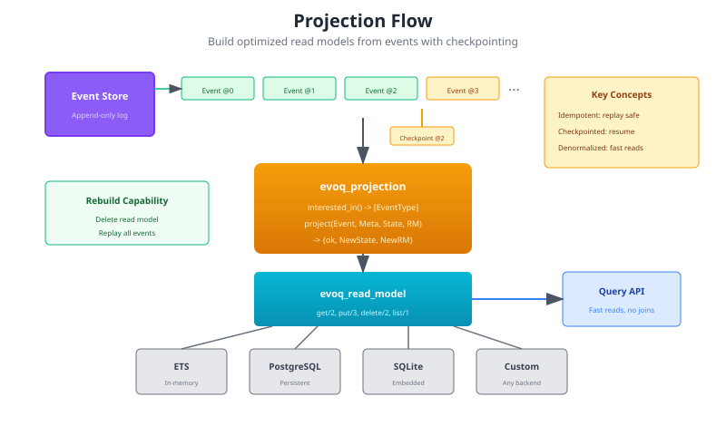

# Projections

Projections build read models from events. They transform the event stream into optimized views for queries, enabling fast reads without impacting write performance.



## When to Use Projections

Use projections for:

- **Query-optimized views** - Denormalized data for fast reads
- **Aggregated data** - Counts, sums, statistics
- **Cross-aggregate views** - Data from multiple aggregates
- **Search indexes** - Full-text search, filtering

The key insight: read models can be **rebuilt** by replaying events.

## Understanding Event Envelope Structure

**IMPORTANT:** Projections receive events wrapped in an `evoq_event` envelope. The first parameter to `project/4` is a map with this structure:

```erlang
#{
    event_type => <<"OrderPlaced">>,     %% Event type (binary)
    data => #{                            %% ← YOUR BUSINESS EVENT PAYLOAD
        order_id => <<"ord-123">>,
        customer_id => <<"cust-456">>,
        total => 99.99,
        items => [...]
    },
    metadata => #{                        %% ← Envelope metadata
        aggregate_id => <<"ord-123">>,
        correlation_id => <<"req-abc">>,
        causation_id => <<"cmd-xyz">>,
        timestamp => 1703001234567
    },
    tags => [<<"tenant:acme">>],
    ...
}
```

**Key fields:**
- `event_type` - Binary identifying the event type
- `data` - **Your business event payload** (extract this)
- `metadata` - Cross-cutting metadata (correlation_id, causation_id, etc.)
- `tags` - Optional tags for cross-stream queries

The second parameter (`Metadata`) is the envelope metadata, duplicated for convenience.

**See [Event Envelope Guide](event_envelope.md) for complete details.**

## Basic Projection

```erlang
-module(order_summary_projection).
-behaviour(evoq_projection).

-export([interested_in/0, init/1, project/4]).

%% Events this projection processes
interested_in() ->
    [<<"OrderPlaced">>, <<"OrderShipped">>, <<"OrderCancelled">>].

%% Initialize projection with a read model backend
init(_Config) ->
    {ok, ReadModel} = evoq_read_model:new(evoq_read_model_ets, #{}),
    {ok, #{}, ReadModel}.

%% Project each event into the read model
project(#{event_type := <<"OrderPlaced">>, data := Data}, Metadata, State, ReadModel) ->
    OrderId = maps:get(aggregate_id, Metadata),
    Summary = #{
        order_id => OrderId,
        customer_id => maps:get(customer_id, Data),
        total => maps:get(total, Data),
        items => maps:get(items, Data),
        status => placed,
        placed_at => maps:get(timestamp, Metadata)
    },
    {ok, NewRM} = evoq_read_model:put(OrderId, Summary, ReadModel),
    {ok, State, NewRM};

project(#{event_type := <<"OrderShipped">>, data := Data}, Metadata, State, ReadModel) ->
    OrderId = maps:get(aggregate_id, Metadata),
    case evoq_read_model:get(OrderId, ReadModel) of
        {ok, Summary} ->
            Updated = Summary#{
                status => shipped,
                tracking_number => maps:get(tracking_number, Data),
                shipped_at => maps:get(timestamp, Metadata)
            },
            {ok, NewRM} = evoq_read_model:put(OrderId, Updated, ReadModel),
            {ok, State, NewRM};
        {error, not_found} ->
            %% Order not found - skip
            {skip, State, ReadModel}
    end;

project(#{event_type := <<"OrderCancelled">>}, Metadata, State, ReadModel) ->
    OrderId = maps:get(aggregate_id, Metadata),
    case evoq_read_model:get(OrderId, ReadModel) of
        {ok, Summary} ->
            Updated = Summary#{
                status => cancelled,
                cancelled_at => maps:get(timestamp, Metadata)
            },
            {ok, NewRM} = evoq_read_model:put(OrderId, Updated, ReadModel),
            {ok, State, NewRM};
        {error, not_found} ->
            {skip, State, ReadModel}
    end.
```

## Required Callbacks

### interested_in/0

Declare which event types to process:

```erlang
-spec interested_in() -> [EventType :: binary()].

interested_in() ->
    [<<"UserRegistered">>, <<"ProfileUpdated">>, <<"UserDeactivated">>].
```

### init/1

Initialize projection state and read model:

```erlang
-spec init(Config :: map()) ->
    {ok, State :: term(), ReadModel :: term()} |
    {error, Reason :: term()}.

init(Config) ->
    %% Choose read model backend
    Backend = maps:get(backend, Config, evoq_read_model_ets),
    {ok, ReadModel} = evoq_read_model:new(Backend, Config),

    %% Initial state
    State = #{
        events_processed => 0,
        last_event_time => undefined
    },

    {ok, State, ReadModel}.
```

### project/4

Transform an event into read model updates:

```erlang
-spec project(Event :: map(), Metadata :: map(), State :: term(), ReadModel :: term()) ->
    {ok, NewState :: term(), NewReadModel :: term()} |
    {skip, State :: term(), ReadModel :: term()}.

project(Event, Metadata, State, ReadModel) ->
    %% Event: #{event_type => ..., data => ...}
    %% Metadata: #{aggregate_id => ..., version => ..., timestamp => ...}

    %% Update read model
    {ok, NewRM} = update_read_model(Event, ReadModel),

    %% Update projection state
    NewState = State#{
        events_processed => maps:get(events_processed, State) + 1,
        last_event_time => maps:get(timestamp, Metadata)
    },

    {ok, NewState, NewRM}.
```

## Read Model Backends

evoq provides a `evoq_read_model` abstraction with multiple backends:

### ETS (In-Memory)

Fast, volatile storage. Good for caching and development.

```erlang
init(_Config) ->
    {ok, RM} = evoq_read_model:new(evoq_read_model_ets, #{
        table_name => order_summaries
    }),
    {ok, #{}, RM}.
```

### PostgreSQL

Persistent, queryable storage. Good for production.

```erlang
init(Config) ->
    {ok, RM} = evoq_read_model:new(evoq_read_model_postgres, #{
        pool => my_pool,
        table => <<"order_summaries">>
    }),
    {ok, #{}, RM}.
```

### Custom Backend

Implement the `evoq_read_model` behavior:

```erlang
-module(my_custom_read_model).
-behaviour(evoq_read_model).

-export([new/1, get/2, put/3, delete/2, list/1]).

new(Config) -> {ok, State}.
get(Key, State) -> {ok, Value} | {error, not_found}.
put(Key, Value, State) -> {ok, NewState}.
delete(Key, State) -> {ok, NewState}.
list(State) -> {ok, [Key]}.
```

## Checkpointing

A projection records the position of the last event it projected, after
every event, and skips any event at or below it as already projected. With
no checkpoint store the position lives in the process and starts at -1 on
every boot, which suits an in-memory read model rebuilt from the store on
each start. A read model that survives a restart needs a checkpoint store
that survives it too:

```erlang
evoq_projection:start_link(order_summary_projection, #{},
                           #{checkpoint_store => my_checkpoint_store}).
```

The store implements `evoq_checkpoint_store` (`load/1`, `save/2`,
`delete/1`). `evoq_checkpoint_store_ets` keeps it in ETS, which does not
survive a restart either.

### What the position is

Events from the store subscription carry `global_position` in their
metadata: the event's index in the store's global log. It names the same
event in every boot, whatever handlers exist, and it is what the checkpoint
holds. A rebuild delivers the same `global_position`, so a checkpoint saved
by a rebuild and one saved from the live feed agree.

Before 1.25.0 the checkpoint held the subscription's per-boot counter,
`version` in the metadata, which restarts at 0 and counts only events that
have a handler. When the set of handlers changed between boots, a saved
checkpoint pointed at a different event: events appended while the node was
down were skipped, or projected events were projected again. `version` is
still there for anything that reads it; do not persist it.

Events handed to `evoq_projection:notify/4` directly have no
`global_position` and are checkpointed on `version`. The two numbers are not
comparable, so a projection takes its events from one source, never both.

### Known limit: a late projection on several new types

A projection whose handler registers after the store subscription's
catch-up (every projection in an application that boots after the one that
owns the store) gets its history through backfill, which runs for each type
separately, the whole history of one type and then the next. Backfilling the
first type moves the checkpoint to that type's last position, and the second
type's backfill then skips every event of its own below that position. Only
the second type's events after the first type's last one are projected.

Backfill also runs only for a type's first handler ever. A projection on a
type another handler already covers gets no history of that type at all.

Both are fixed in evoq 2.0.0. Until then, a multi-type projection that must
see its whole history should register before the store subscription starts
(in the application that owns the store) or call `evoq_projection:rebuild/1`
once its handlers are registered.

## Rebuilding Projections

A rebuild clears the read model, sets the checkpoint back to -1, and
replays every event of the projection's types from the store, page by page
through the global log, so it is not capped at one read batch:

```erlang
ok = evoq_projection:rebuild(ProjectionPid).
```

The page size is the `replay_batch_size` application setting (default 1000).
The events and metadata a rebuild hands to `project/4` have the same shape
as the store subscription's, with `replaying => true` added.

This is powerful:
- Fix bugs in projection logic
- Add new fields to read model
- Migrate to a new storage backend
- Test projection changes safely

## Cross-Aggregate Projections

Projections can combine data from multiple aggregates:

```erlang
-module(customer_orders_projection).
-behaviour(evoq_projection).

interested_in() ->
    [<<"CustomerRegistered">>, <<"OrderPlaced">>, <<"OrderShipped">>].

project(#{event_type := <<"CustomerRegistered">>, data := Data}, Meta, State, RM) ->
    CustomerId = maps:get(aggregate_id, Meta),
    Customer = #{
        customer_id => CustomerId,
        name => maps:get(name, Data),
        email => maps:get(email, Data),
        orders => [],
        total_spent => 0
    },
    {ok, NewRM} = evoq_read_model:put(CustomerId, Customer, RM),
    {ok, State, NewRM};

project(#{event_type := <<"OrderPlaced">>, data := Data}, _Meta, State, RM) ->
    CustomerId = maps:get(customer_id, Data),
    case evoq_read_model:get(CustomerId, RM) of
        {ok, Customer} ->
            OrderSummary = #{
                order_id => maps:get(order_id, Data),
                total => maps:get(total, Data),
                status => placed
            },
            Updated = Customer#{
                orders => [OrderSummary | maps:get(orders, Customer)],
                total_spent => maps:get(total_spent, Customer) + maps:get(total, Data)
            },
            {ok, NewRM} = evoq_read_model:put(CustomerId, Updated, RM),
            {ok, State, NewRM};
        {error, not_found} ->
            {skip, State, RM}
    end.
```

## Aggregation Projections

Build statistics and summaries:

```erlang
-module(daily_stats_projection).
-behaviour(evoq_projection).

interested_in() ->
    [<<"OrderPlaced">>, <<"OrderCancelled">>].

project(#{event_type := <<"OrderPlaced">>, data := Data}, Meta, State, RM) ->
    Date = date_from_timestamp(maps:get(timestamp, Meta)),

    Stats = case evoq_read_model:get(Date, RM) of
        {ok, Existing} -> Existing;
        {error, not_found} -> #{orders => 0, revenue => 0, cancelled => 0}
    end,

    Updated = Stats#{
        orders => maps:get(orders, Stats) + 1,
        revenue => maps:get(revenue, Stats) + maps:get(total, Data)
    },

    {ok, NewRM} = evoq_read_model:put(Date, Updated, RM),
    {ok, State, NewRM}.
```

## Querying Read Models

Query projections directly:

```erlang
%% Get single item
{ok, OrderSummary} = evoq_read_model:get(OrderId, ReadModel).

%% List all items
{ok, AllOrders} = evoq_read_model:list(ReadModel).

%% Backend-specific queries (PostgreSQL)
{ok, RecentOrders} = evoq_read_model_postgres:query(
    ReadModel,
    "SELECT * FROM order_summaries WHERE status = $1 ORDER BY placed_at DESC LIMIT $2",
    [<<"placed">>, 10]
).
```

## Testing Projections

Test projections with event sequences:

```erlang
-module(order_summary_projection_tests).
-include_lib("eunit/include/eunit.hrl").

project_order_lifecycle_test() ->
    %% Setup
    {ok, State0, RM0} = order_summary_projection:init(#{}),

    %% Order placed
    PlacedEvent = #{
        event_type => <<"OrderPlaced">>,
        data => #{customer_id => <<"cust-1">>, total => 100, items => []}
    },
    PlacedMeta = #{aggregate_id => <<"order-1">>, timestamp => 1000},

    {ok, State1, RM1} = order_summary_projection:project(PlacedEvent, PlacedMeta, State0, RM0),

    %% Verify
    {ok, Summary1} = evoq_read_model:get(<<"order-1">>, RM1),
    ?assertEqual(placed, maps:get(status, Summary1)),
    ?assertEqual(100, maps:get(total, Summary1)),

    %% Order shipped
    ShippedEvent = #{
        event_type => <<"OrderShipped">>,
        data => #{tracking_number => <<"TRACK123">>}
    },
    ShippedMeta = #{aggregate_id => <<"order-1">>, timestamp => 2000},

    {ok, _State2, RM2} = order_summary_projection:project(ShippedEvent, ShippedMeta, State1, RM1),

    %% Verify
    {ok, Summary2} = evoq_read_model:get(<<"order-1">>, RM2),
    ?assertEqual(shipped, maps:get(status, Summary2)),
    ?assertEqual(<<"TRACK123">>, maps:get(tracking_number, Summary2)).
```

## Telemetry Events

Projections emit telemetry:

| Event | Measurements | Metadata |
|-------|--------------|----------|
| `[evoq, projection, start]` | system_time | name |
| `[evoq, projection, stop]` | duration | name |
| `[evoq, projection, event]` | duration | name, event_type |
| `[evoq, projection, checkpoint]` | position | name |
| `[evoq, projection, rebuild, start]` | system_time | name |
| `[evoq, projection, rebuild, stop]` | duration, events_processed | name |

## Best Practices

### 1. Design for Queries

Think about how the data will be queried:

```erlang
%% Good - optimized for "get orders by customer"
project(Event, Meta, State, RM) ->
    CustomerId = maps:get(customer_id, Event),
    Key = {customer, CustomerId},
    %% One lookup per customer
    ...
```

### 2. Handle Missing Data

Events may arrive out of order or reference missing entities:

```erlang
project(Event, _Meta, State, RM) ->
    case evoq_read_model:get(ParentId, RM) of
        {ok, Parent} ->
            %% Update normally
            {ok, State, NewRM};
        {error, not_found} ->
            %% Parent doesn't exist - skip or create placeholder
            {skip, State, RM}
    end.
```

### 3. Keep Projections Idempotent

Projections may replay events during rebuild:

```erlang
project(Event, Meta, State, RM) ->
    EventId = maps:get(event_id, Event),
    case already_projected(EventId, State) of
        true -> {skip, State, RM};
        false ->
            %% Project normally
            NewState = mark_projected(EventId, State),
            {ok, NewState, NewRM}
    end.
```

### 4. Monitor Lag

Track how far behind projections are:

```erlang
project(Event, Meta, State, RM) ->
    EventTime = maps:get(timestamp, Meta),
    Lag = erlang:system_time(millisecond) - EventTime,

    telemetry:execute([my_app, projection, lag], #{lag_ms => Lag}, #{
        projection => ?MODULE
    }),

    %% Continue projecting...
    {ok, State, NewRM}.
```

### 5. Version Read Models

Support schema evolution:

```erlang
project(Event, Meta, State, RM) ->
    {ok, Existing} = evoq_read_model:get(Key, RM),

    %% Migrate old format
    Migrated = case Existing of
        #{version := 1} -> migrate_v1_to_v2(Existing);
        #{version := 2} -> Existing;
        _ -> #{version => 2}  %% New record
    end,

    Updated = update_record(Migrated, Event),
    {ok, NewRM} = evoq_read_model:put(Key, Updated#{version => 2}, RM),
    {ok, State, NewRM}.
```

## Next Steps

- [Event Handlers](event_handlers.md) - Side effects
- [Process Managers](process_managers.md) - Orchestration
- [Architecture](architecture.md) - System overview
